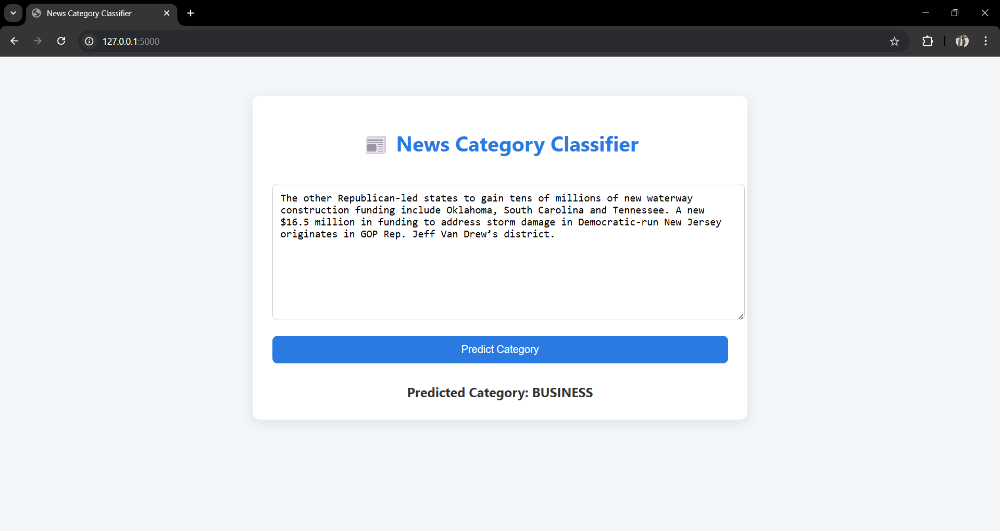

# 📰 News Category Classifier (Transformer + Flask)

This web app uses a transformer model to classify news articles into one of 42 categories. The model was trained on kaggle and deployed using Flask.

## 📦 Features

- Custom Trained Transformer model
- Flask backend with a responsive HTML frontend
- Supports 42 news categories
- Simple and clean UI
- Project built for educational purposes

## 🖼️ Screenshot



## 🚀 Run Locally

```bash
git clone https://github.com/heshamebaid/news-category-classifier.git
cd news-category-classifier
pip install -r requirements.txt
python app.py
